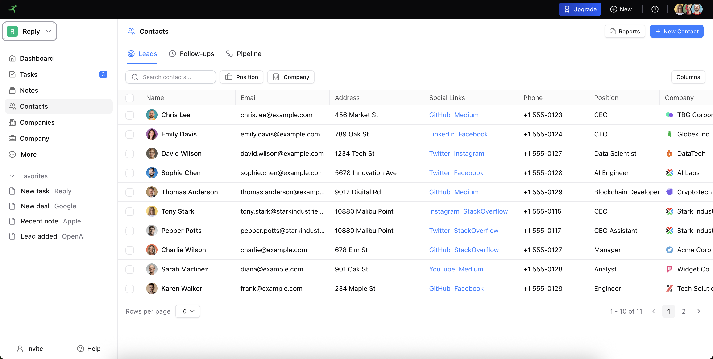

# 🚀 Agentic CRM Challenge

Una challenge pratica per migliorare le proprie skill con **GitHub Copilot** sviluppando un CRM completo utilizzando tecniche di sviluppo assistito da AI.

## 📸 Anteprima



## 🎯 Obiettivo della Challenge

L'obiettivo di questa challenge è imparare a utilizzare efficacemente GitHub Copilot per:

- Generare codice in modo efficiente
- Implementare funzionalità complesse con l'aiuto dell'AI
- Migliorare la produttività nello sviluppo software
- Comprendere come collaborare con un assistente AI nel processo di sviluppo

## 🛠️ Tecnologie Utilizzate

- **React 19** - Libreria UI
- **TypeScript** - Tipizzazione statica
- **Vite** - Build tool e dev server
- **Tailwind CSS 4** - Framework CSS utility-first
- **[ReUI](https://reui.io/)** - Component library per React
- **SQLite (sql.js)** - Database nel browser per la persistenza dei dati

> ⚠️ **Nota**: Per semplicità, tutte le funzionalità dovranno essere implementate utilizzando **SQLite come database nel browser**. Questo permette di avere persistenza dei dati senza necessità di un backend esterno.

## 📋 Prerequisiti

- Node.js 20.19 o superiore
- NPM installato sul PC
- (Opzionale) **ReUI MCP Server** per migliorare l'assistenza di GitHub Copilot → [Guida installazione](docs/MCP.md)

## 🚀 Installazione e Avvio

1. **Clona il repository** e accedi alla root del progetto:

   ```bash
   cd agentic-crm-challenge
   ```

2. **Installa le dipendenze**:

   ```bash
   npm install
   ```

3. **Esegui la build**:

   ```bash
   npm run build
   ```

4. **Avvia il server di sviluppo**:

   ```bash
   npm run dev
   ```

5. Apri il browser su `http://localhost:5173`

## ✅ Task della Challenge

Di seguito i task da completare durante la challenge. Usa GitHub Copilot per aiutarti nell'implementazione!

### Task 1: Setup Database SQLite

- [ ] Configurare sql.js per utilizzare SQLite nel browser
- [ ] Creare lo schema del database per contacts, companies, deals, tasks, notes
- [ ] Implementare le funzioni CRUD base

### Task 2: Persistenza Contatti

- [ ] Collegare la lista contatti al database SQLite
- [ ] Implementare creazione nuovo contatto con salvataggio su DB
- [ ] Implementare modifica e eliminazione contatti

### Task 3: Persistenza Aziende

- [ ] Collegare la lista aziende al database SQLite
- [ ] Implementare creazione nuova azienda con salvataggio su DB
- [ ] Implementare modifica e eliminazione aziende

### Task 4: Gestione Deals

- [ ] Collegare la pipeline deals al database SQLite
- [ ] Implementare drag & drop con aggiornamento stato su DB
- [ ] Implementare creazione e modifica deals

### Task 5: Tasks e Note

- [ ] Implementare persistenza tasks
- [ ] Implementare persistenza note
- [ ] Collegare tasks e note a contatti/aziende

### Task 6: Dashboard Analytics

- [ ] Implementare query aggregate per statistiche
- [ ] Creare grafici dinamici basati sui dati reali
- [ ] Aggiungere filtri per periodo temporale

### Bonus Tasks

- [ ] Implementare ricerca full-text
- [ ] Aggiungere export/import dati
- [ ] Implementare undo/redo operazioni

## 📚 Risorse Utili
- [GitHub Copilot Documentation](https://docs.github.com/en/copilot)
- [sql.js Documentation](https://sql.js.org/)
- [React Documentation](https://react.dev/)
- [Tailwind CSS Documentation](https://tailwindcss.com/docs)


## Utilizzo di GitHub Copilot
Leggi `copilot-instructions.md` per la configurazione, le best practice e le convenzioni del repository.  
Consulta `prompts/challenges` per una libreria di prompt riutilizzabili, pensata appositamente per questo progetto.  

**Suggerimento rapido:** quando chiedi a Copilot di generare codice, includi i percorsi dei file, i tipi e richiedi l’allineamento a TypeScript in modalità strict, alle regole degli hook ESLint, all’ordinamento delle classi Tailwind e agli import con alias `@`.

## 📝 Licenza

Questo progetto è stato creato per scopi educativi.
